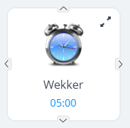

# Home Center 3 and Node-RED code snippets<!-- omit in toc -->

On this page you'll find code snippets I found and created myself. I want to share them and hope they help you creating an awesome smarthome.

## 📑 Table of Contents<!-- omit in toc -->

- [LUA: Load URL with basic authentication](#lua-load-url-with-basic-authentication)
- [API: update a Quick App](#api-update-a-quick-app)
- [LUA: read condition/trigger event information](#lua-read-conditiontrigger-event-information)
- [LUA: How to read if Home, Away,Vacation or Night profile is active](#lua-how-to-readif-home-awayvacation-or-night-profile-is-active)
- [LUA: HC3 version of `if fibaro:countScenes() > 1 then fibaro:abort() end`](#lua-hc3-version-of-if-fibarocountscenes--1-then-fibaroabort-end)
- [LUA: Read variables from QA device](#lua-read-variables-from-qa-device)
- [LUA: Condition to run scene every minute between 09:00 and 11:00](#lua-condition-to-run-scene-every-minute-between-0900-and-1100)
- [LUA: Condition to run at 04:00 and when profile VACATION goes active](#lua-condition-to-run-at-0400-and-when-profile-vacation-goes-active)
- [LUA: send a push message](#lua-send-a-push-message)
- [LUA: control ledstrip with native Hue API](#lua-control-ledstrip-with-native-hue-api)
- [QA: add log text below device icon](#qa-add-log-text-below-device-icon)
- [LUA: read Quick App variable](#lua-read-quick-app-variable)
- [LUA: control Sonos with Node-RED](#lua-control-sonos-with-node-red)
- [QA: send args and run function with HTTP REST API](#qa-send-args-and-run-function-with-http-rest-api)
- [QA: read label/button/slider value](#qa-read-labelbuttonslider-value)


### LUA: Load URL with basic authentication

```lua
local Host   = "192.168.199.134"
local Port   = "80"
local tcpTimeout = 2000
local srvUser = "admin"
local srvPwd = "admin"

local texte = string.format("%s %s", tostring(os.date('%H:%m', os.time() )), "HC3 : This is a test.")
local mymsg = string.format("?color=%s&bg=%s&t=%s", "black", "white",texte)

function urlencode(str)
  if (str) then
    str = string.gsub (str, "\n", "\r\n")
    str = string.gsub (str, "([^%w %-%_%.%~])", function (c) return string.format ("%%%02X", string.byte(c)) end)
    str = string.gsub (str, " ", "+")
  end
  return str	
end

function base64(data)
    local b='ABCDEFGHIJKLMNOPQRSTUVWXYZabcdefghijklmnopqrstuvwxyz0123456789+/'
    return ((data:gsub('.', function(x) 
            local r,b='',x:byte() for i=8,1,-1 do r=r..(b%2^i-b%2^(i-1)>0 and '1' or '0') end
            return r;
          end)..'0000'):gsub('%d%d%d?%d?%d?%d?', function(x)
          if (#x < 6) then return '' end
          local c=0
          for i=1,6 do c=c+(x:sub(i,i)=='1' and 2^(6-i) or 0) end
          return b:sub(c+1,c+1)
    end)..({ '', '==', '=' })[#data%3+1])
end

local bauth = 'Basic '..base64(srvUser..":"..srvPwd)
local url = "http://" .. Host .. ":" .. Port .. "/write" .. urlencode(mymsg)

net.HTTPClient():request(url, {
    options={
      method = 'GET',
      headers = {
          ["Authorization"] = bauth
        },
      timeout = tcpTimeout,
    },
    success = function(response) 
            print(response.status)
            print(response.data)
    end,
    error = function(message)
            print("error:", message)
    end
})
```

### API: update a Quick App

POST `/api/devices/<deviceID>/action/updateProperty`

```json
{ "args": [ "value", <value> ] }
```

### LUA: read condition/trigger event information

```lua
print("sourceTrigger", json.encode(sourceTrigger)
local event = sourceTrigger
if event.type == "location" and event.value == "enter" and event.property and event.property == 219 then
	if between("$Sunset..$Sunrise") then
		fibaro.call({780}, "turnOn")
	end
end
```

### LUA: How to read if Home, Away,Vacation or Night profile is active

```lua
function getActiveProfileName()
    local profiles = api.get("/profiles")
    for _, profile in ipairs(profiles.profiles) do
        if (profile.id == profiles.activeProfile) then
            return profile.name
        end
    end
end
```

### LUA: HC3 version of `if fibaro:countScenes() > 1 then fibaro:abort() end`

Set *Scene* → *Basic configuration* → *Allow to restart a running scene* → **No**

### LUA: Read variables from QA device

```lua
function getVariable(id, name)
	local device = api.get("/devices/".. id) or { properties = {} }
      for _, v in ipairs(device.properties.quickAppVariables or {}) do
        if v.name == name then return v.value end
      end
    return ""
  end
```

### LUA: Condition to run scene every minute between 09:00 and 11:00

```lua
{
    operator = "all",
    conditions = {
        {
            type = "date",
            property = "cron",
            operator = "match",
            value = {
                date = {"*", "9", "*", "*", "*","*"},
            },
            isTrigger = true
        },
        {
            type = "date",
            property = "cron",
            operator = "match",
            value = {
                date = {"*", "10", "*", "*", "*","*"},
            },
        },
    }
}
```

### LUA: Condition to run at 04:00 and when profile VACATION goes active

```lua
{
    operator = "any",
    conditions ={
        {
            type = "profile",
            property = "activeProfile",
            operator = "==",
            value = 3,
            isTrigger = true
        },
        {
            type = "date",
            property = "cron",
            operator = "match",
            value = { "30", "20", "*", "*", "*", "*" },
            isTrigger = true
        }
    }
}

...

if (sourceTrigger.type == "date") then
    -- CRON trigger
    fibaro.debug("Scene6", "Read alarm clock time now...")
elseif (sourceTrigger.type == "profile") then
		-- PROFILE changed!
    fibaro.debug("Scene6", "Profile changed, do thing here...")
else
	-- Manual started by USER
    fibaro.debug("Scene6", "Manual triggered by user...")
end
```

### LUA: send a push message

```lua
fibaro.alert("push", {2}, "Hi, it works!")
fibaro.alert("push", {2, 20}, "Hi, it works for 2 users!")
```

### LUA: control ledstrip with native Hue API

Set the correct brightness and color with the Hue App and read the data with the official API:

```
http://192.168.2.1/api/<apikey>/lights/
http://192.168.2.1/api/<apikey>/lights/4
```

```json
"4": {
    "state": {
        "on": true,
        "bri": 114,
        "hue": 5046,
        "sat": 198,
        "effect": "none",
        "xy": [
            0.5428,
            0.3836
        ],
        "ct": 500,
        "alert": "none",
        "colormode": "xy",
        "mode": "homeautomation",
        "reachable": true
    },
...
```

🌎 [Official Hue API documentation](https://developers.meethue.com/develop/hue-api/lights-api/)

```lua
function controlLedstrip(id, state, bri, hue, sat)
    local tcpTimeout  = 2000
    local hueBridgeId = 31
    local hueConfig   = api.get("/devices?id=" .. tostring(hueBridgeId))
    local hueLight    = api.get("/devices?id=" .. tostring(id))
    
    local host    = hueConfig.properties.ip
    local user    = hueConfig.properties.userName
    local lightId = hueLight.properties.lightId

    net.HTTPClient():request("http://" .. host .. "/api/" .. user .. "/lights/" .. lightId .. "/state", {
        options={ 
            method = 'PUT',
            headers = {['Content-Type']  = 'application/json'},
            timeout = tcpTimeout,
            data = '{"on":' .. tostring(state) .. ',"bri":' .. tostring(bri) .. ', "hue":' .. tostring(hue) .. ',"sat":' .. tostring(sat) .. '}',
        },
        success = function(response)
            fibaro.debug("Scene38", response.status .. " " .. response.data)
        end,
        error = function(message)
            fibaro.debug("Scene38", "HTTPClient error: " .. message)
        end
    })
end

controlLedstrip(39, true, 29, 5147, 200)
```

### QA: add log text below device icon

```lua
self:updateProperty("log", "insert text here")
```



### LUA: read Quick App variable

```lua
function getQAVariable(id, var)
    local qaDevice = api.get("/devices/" .. id) 
    for _, quickAppVariables in ipairs(qaDevice.properties.quickAppVariables) do
        if (quickAppVariables.name == var) then
            return quickAppVariables.value
        end
    end
end

getQAVariable(43, "alarmTime") -- QA alarm clock sample (binairy switch type)
```

### LUA: control Sonos with Node-RED

```lua
function playMusic(host, players)
    net.HTTPClient():request("http://" .. host .. "/sonos/play", {
        options={
            method  = 'POST',
            headers = {["Content-Type"] = "application/json"},
            timeout = 2000,
            data    = players
        },
        success = function(response) 
            fibaro.debug("Scene6", response.status .. " " .. response.data)
        end,
        error = function(message)
            fibaro.debug("Scene6", "HTTPClient error: " .. message)
        end
    })
end

local host  = "192.168.2.101:1880"
local sleepingAudio = fibaro.getGlobalVariable("SleepingAudio")
playMusic(host, sleepingAudio)
```

```lua
function wakeupMusic(host, player, station, volume)
    -- payload: {"playerName": "Werkhoek", "station": "KINK", "volume": 10}
    net.HTTPClient():request("http://" .. host .. "/sonos/wakeup", {
        options={
            method  = 'POST',
            headers = {["Content-Type"] = "application/json"},
            timeout = 2000,
            data    = '{"playerName": "' .. player .. '", "station": "' .. station .. '", "volume": ' .. tostring(volume) .. '}'
        },
        success = function(response) 
            fibaro.debug("Scene6", response.status .. " " .. response.data)
        end,
        error = function(message)
            fibaro.debug("Scene6", "HTTPClient error: " .. message)
        end
    })
end

wakeupMusic("192.168.2.101:1880", "Werkhoek", "NPO Radio 2", 5)
```

### QA: send args and run function with HTTP REST API

```lua
function QuickApp:sendMessage(msg)
    local message = string.gsub(decode(msg), '\\n', '\n')
    fibaro.alert("push", {2,20}, message)
end
```

```jsx
http://192.168.2.55/api/devices/208/action/sendMessage

var scene = {};
var notification = "test"

scene = {
  headers: { 'content-type':'application/json' },
  payload: { 'args': [notification] }
};

return scene;
```

### QA: read label/button/slider value

Source

```jsx
local function getView(deviceId,name,typ)
  local function find(s)
    if type(s) == 'table' then
      if s.name==name then return s[typ]
      else for _,v in pairs(s) do local r = find(v) if r then return r end end end
    end
  end
  return find(api.get("/plugins/getView?id="..deviceId)["$jason"].body.sections)
end

getView(39,"myLabel","text")
```